# Tuyen Sinh — Algorithm & Data Flow Documentation

> This document describes every algorithm used in the admission processing pipeline,
> illustrated with Mermaid diagrams. All diagrams can be rendered inside VS Code with
> the "Markdown Preview Mermaid Support" extension, or on <https://mermaid.live>.

---

## Table of Contents

1. [System Overview](#1-system-overview)
2. [Data Model](#2-data-model)
3. [Phase 1 — Output Workbook Initialisation](#3-phase-1--output-workbook-initialisation)
4. [Phase 2 — Student Distribution](#4-phase-2--student-distribution)
5. [Phase 3 — Subject Combination (Khoi) Loading](#5-phase-3--subject-combination-khoi-loading)
6. [Phase 4 — Score Calculation](#6-phase-4--score-calculation)
   - [4a. Build Book2 Lookup](#6a-build-book2-lookup)
   - [4b. Weighted Score Formula](#6b-weighted-score-formula)
   - [4c. Priority Bonus Formula](#6c-priority-bonus-formula)
   - [4d. Per-Student Score Pipeline](#6d-per-student-score-pipeline)
7. [Phase 5 — Deduplication](#7-phase-5--deduplication)
8. [Full End-to-End Sequence](#8-full-end-to-end-sequence)
9. [Full End-to-End Activity Diagram](#9-full-end-to-end-activity-diagram)
10. [Subject Column Mapping Reference](#10-subject-column-mapping-reference)
11. [Priority Bonus Tables](#11-priority-bonus-tables)

---

## 1. System Overview

The pipeline reads three Excel input files, calculates a weighted admission score for
every applicant per major, deduplicates students who applied to multiple majors, and
writes a ranked output file.

```
┌─────────────────┐   ┌──────────────┐   ┌──────────────┐
│ toHop_THTP.xlsx │   │  Book1.xlsx  │   │  Book2.xlsx  │
│ (major ↔ khoi   │   │ (applications│   │ (exam scores │
│  mapping)       │   │  + PTXT)     │   │  + priority) │
└────────┬────────┘   └──────┬───────┘   └──────┬───────┘
         │                   │                   │
         ▼                   ▼                   ▼
    ┌────────────────────────────────────────────────┐
    │              main.py  (pipeline)               │
    │   Phase 1 → Phase 2 → Phase 3 → Phase 4 → 5   │
    └────────────────────┬───────────────────────────┘
                         │
                         ▼
               ┌──────────────────┐
               │ ExampleOutput.xlsx│
               │ one sheet/major  │
               │ sorted by score  │
               └──────────────────┘
```

---

## 2. Data Model

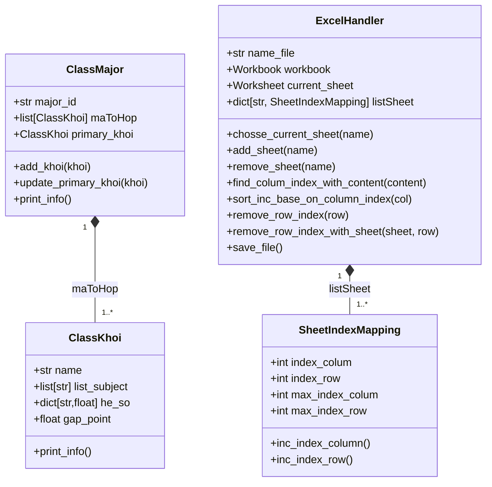

---

## 3. Phase 1 — Output Workbook Initialisation

**Goal:** Create `ExampleOutput.xlsx` with one named sheet per unique major ID found in
`toHop_THTP.xlsx`. Copy the header row from `Book1.xlsx` into each sheet.

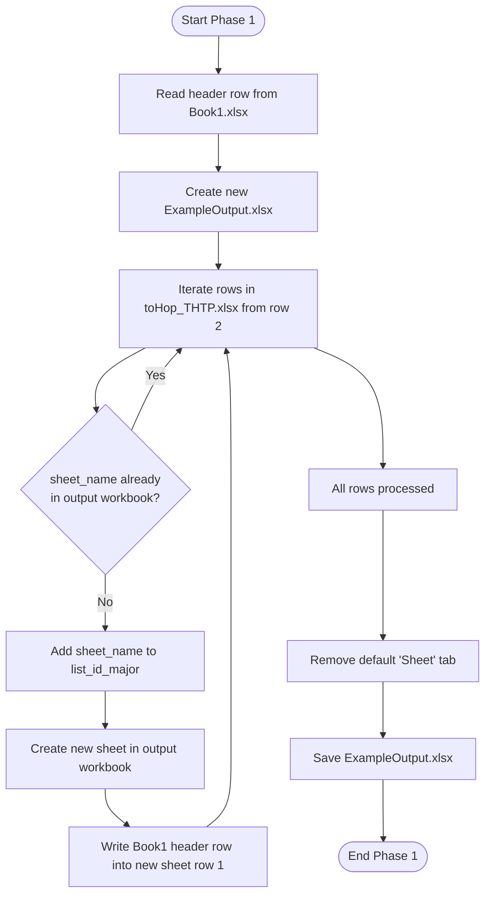

---

## 4. Phase 2 — Student Distribution

**Goal:** Copy each eligible application row from `Book1.xlsx` into the correct major
sheet in `ExampleOutput.xlsx`. Only rows where `Mã PTXT == '100'` are included.

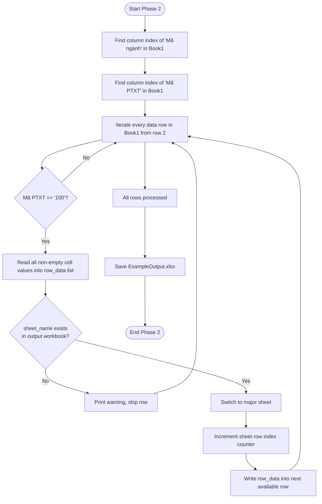

---

## 5. Phase 3 — Subject Combination (Khoi) Loading

**Goal:** For every major in `list_id_major`, read `toHop_THTP.xlsx` and build a
`ClassMajor` object containing all associated `ClassKhoi` objects with their subjects,
weighting coefficients (`he_so`), and gap bonus.

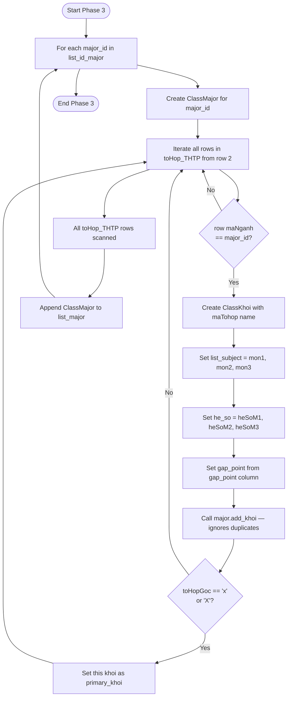

### `add_khoi` deduplication algorithm

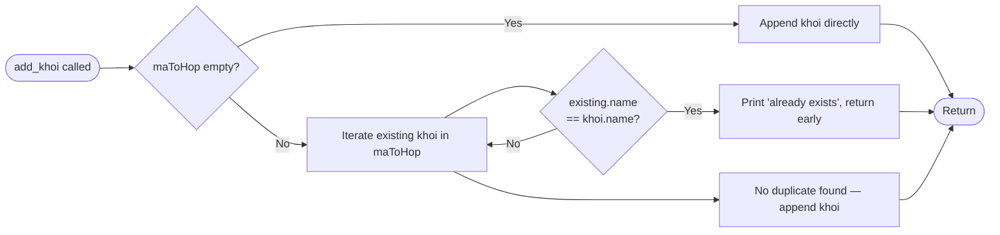

---

## 6. Phase 4 — Score Calculation

### 6a. Build Book2 Lookup

**Goal:** Pre-index Book2 rows by CMND so every student lookup is O(1) instead of O(N).

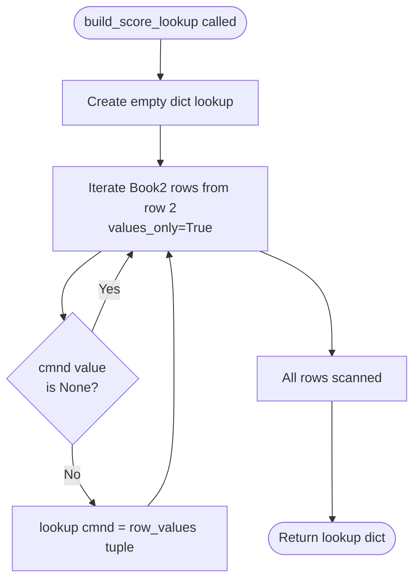

### 6b. Weighted Score Formula

For each subject combination (khoi), the admission score is:

$$\text{point} = 3 \times \frac{\sum_{i=1}^{3} \text{score}_i \times \text{heSo}_i}{\sum_{i=1}^{3} \text{heSo}_i}$$

Maximum possible score = **30** (all subjects score 10 with equal weights).

The **best khoi** across all combinations is selected:

$$\text{max\_point} = \max_{\text{khoi} \in \text{maToHop}} \text{point}_{\text{khoi}}$$

$$\text{max\_point\_add\_gap} = \text{max\_point} + \text{gap\_point}_{\text{best khoi}}$$

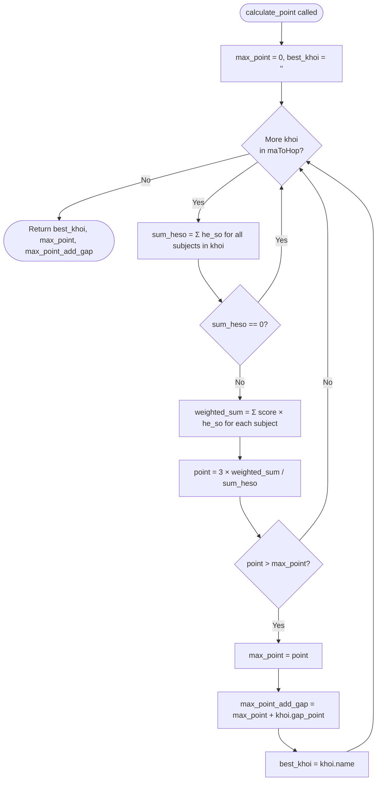

### 6c. Priority Bonus Formula

The **priority-adjusted final score** applies a bonus that scales with available
headroom from the maximum score (30):

$$\text{final\_point} = \text{max\_point} + \frac{30 - \text{max\_point}}{7.5} \times \text{ut\_point}$$

Where `ut_point = KVƯT_bonus + ĐTƯT_bonus`:

| KVƯT code | Bonus |
|---|---|
| KV1 | 0.75 |
| KV2-NT / 2NT | 0.50 |
| KV2 | 0.25 |
| KV3 | 0.00 |

| ĐTƯT code | Bonus |
|---|---|
| 01–04 | 2.00 |
| 05–07 | 1.00 |
| Other | 0.00 |

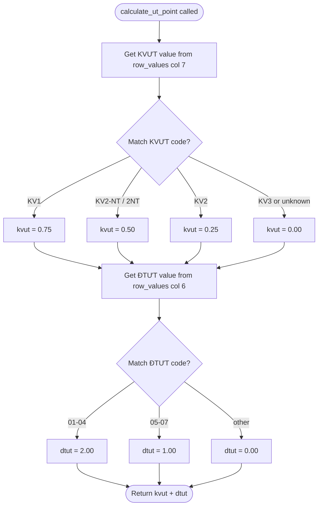

### 6d. Per-Student Score Pipeline

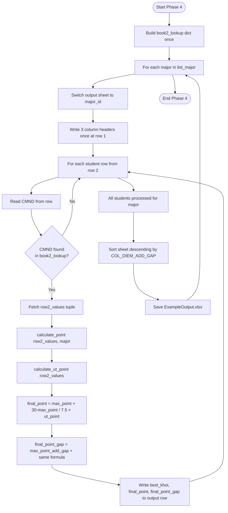

---

## 7. Phase 5 — Deduplication

**Goal:** A student may appear in multiple major sheets (applied to several majors).
Each student must be retained in at most one major sheet — the one they prefer
(lower NV value = higher preference). Processing stops once `TARGETS` sheets are handled.

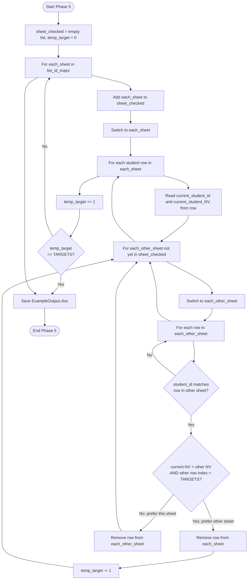

---

## 8. Full End-to-End Sequence

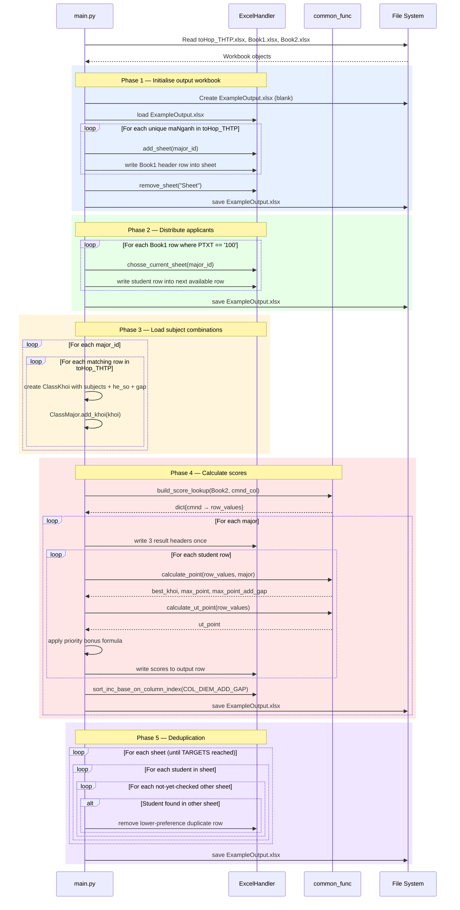

---

## 9. Full End-to-End Activity Diagram

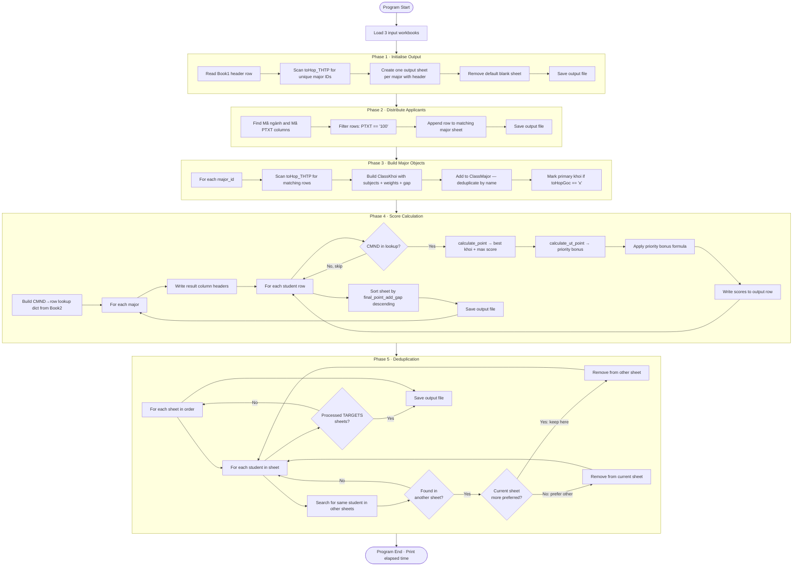

---

## 10. Subject Column Mapping Reference

These are 0-based column indices in `Book2.xlsx` (Sheet1).
When `FIXED_FORMAT = True` these values are used directly.
When `FIXED_FORMAT = False` they are discovered by scanning the header row.

| Subject Code | Meaning | 0-based Column |
|---|---|---|
| `TO` | Toán (Math) | 26 |
| `VA` | Văn (Literature) | 27 |
| `LI` | Lý (Physics) | 28 |
| `HO` | Hoá (Chemistry) | 29 |
| `SI` | Sinh (Biology) | 30 |
| `SU` | Sử (History) | 31 |
| `DI` | Địa (Geography) | 32 |
| `GDCD` | Giáo dục công dân (Civic Education) | 33 |
| `NN` | Ngoại ngữ (Foreign Language) | 34 |
| `KVƯT` | Khu vực ưu tiên (Priority Region) | 7 |
| `ĐTƯT` | Đối tượng ưu tiên (Priority Category) | 6 |

---

## 11. Priority Bonus Tables

### KVƯT — Priority Region (Khu vực ưu tiên)

| Cell Value | Bonus Points |
|---|---|
| `KV1` | 0.75 |
| `KV2-NT` or `2NT` | 0.50 |
| `KV2` | 0.25 |
| `KV3` | 0.00 |
| Anything else | 0.00 |

### ĐTƯT — Priority Category (Đối tượng ưu tiên)

| Cell Value | Bonus Points |
|---|---|
| `01`, `02`, `03`, `04` | 2.00 |
| `05`, `06`, `07` | 1.00 |
| Anything else | 0.00 |

### Combined Priority Bonus

$$\text{ut\_point} = \text{KVƯT\_bonus} + \text{ĐTƯT\_bonus}$$

Maximum possible `ut_point` = **2.75** (KV1 = 0.75 + group-1 category = 2.00).

### Final Score with Priority

$$\text{final\_point} = \text{max\_point} + \frac{30 - \text{max\_point}}{7.5} \times \text{ut\_point}$$

$$\text{final\_point\_add\_gap} = \text{max\_point\_add\_gap} + \frac{30 - \text{max\_point\_add\_gap}}{7.5} \times \text{ut\_point}$$

The factor $\frac{30 - \text{max\_point}}{7.5}$ ensures that students with higher base
scores gain proportionally less from priority bonuses, capping the total score at 30.
